# School_District_Analysis

## Overview of School District Analysis
This analysis examined math and reading test scores in a school district against the following variables: 
- Raw performance data (top and bottom performing schools) 
- Grade level
- Per pupil expenditure
- School size
- School type

In this analysis, due to suspected academic integrity issues amongst 9th graders in Thomas High School, that data was ommitted. This analysis will also include a comparison of the data with Thomas High School 9th graders included and omitted. 

## Methods
- Removing Thomas High School's 9th Grade Test Scores: In order to remove the test scores that may not be an accurate representation of student knowledge, we used the "loc" function within a dataframe. This enabled the code to identify characteristics within the data frame (school_name = Thomas High School and grade = 9th) and then remove that data by setting the dataframe equal to np.nan
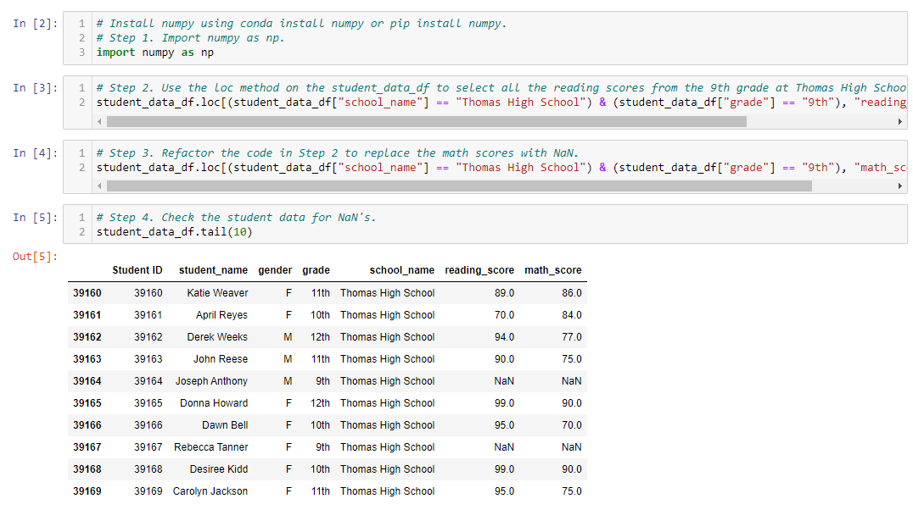

- Once the THS 9th grade test scores were removed from the data, we were able to again use the loc function to identify the 9th graders at Thomas High School and the count function to identify the number of students in 9th grade and in the rest of THS (steps 1 and 2). Identifying these quantities, enabled the calculation of a new percentage based on the number of students passing within 10th-12th grade and the total number of students within 10th-12th grade. 
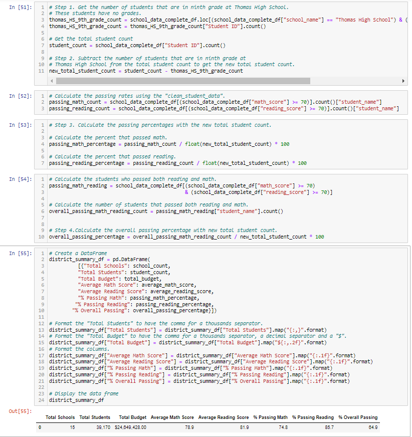

## Results
- Effect on School District Summary: Removing the 9th grade population from Thomas High School did have a very slight effect on the math, reading, and overall test score averages for the district. Without the 9th grade population, test scores for math, reading, and overall dropped by the following margins, respectively: 0.2%, 0.3%, 0.1%. 
     - School District Summary with Thomas High School's 9th Grade Population:
     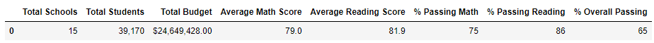
     - School District Summary without Thomas High School's 9th Grade Population:
     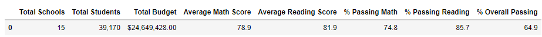
- Effect on School Summary: Similar to the School District Summary, removing Thomas High School's 9th graders from the data caused Thomas High School's test scores to decrease a few tenths of a percent for each value: 0.1%, 0.2%, and 0.3% on math, reading, and overall percentage, respectively. 
     - School Summary with 9th Grade Population:
     
     - School Summary without 9th Grade Population:
     
- Thomas High School's Performance Compared to All Other Schools (with 9th grade omitted): With 9th grade omitted, Thomas High School's position with relation to other schools when comparing overall test scores. Thomas High School remains the second highest scoring school in the district based on overall test scores. However, the margin with which the school earns the second slot has narrowed. With the 9th grade population included, Thomas High School is 0.35% ahead of the next highest score. Where as, without 9th grade included, that percentage drops to 0.03%.
     - THS Performance Comparison with THS's 9th Grade Population:
     
     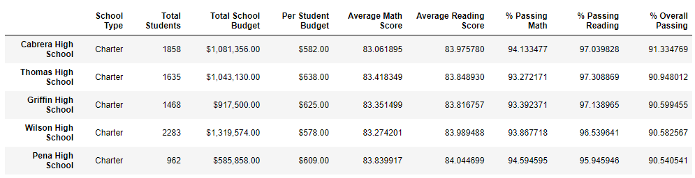
     
     - THS Performance Comparison without THS's 9th Grade Population:
     
     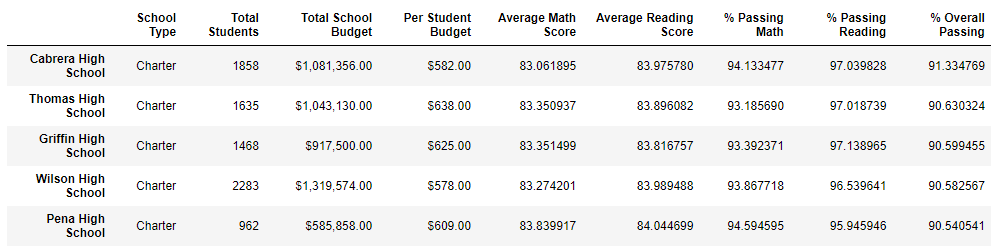
     
- Effect of Omitting Thomas High School's 9th Grade Scores On: 
     - Math & Reading Scores by Grade: When doing scores by grade, we also displayed data by high school within the district. Because of this, the only difference that you will see when omitting Thomas High School's 9th grade scores is that there is an "nan" in the place where Thomas High School's 9th grade scores would go. This signifies that the scores are being omitted. A few points to note are that when the THS 9th grade class was included in the data, the 9th grade had the highest math score average for the school. However, when comparing THS's 9th grade math scores to the district, there is one school that had a higher average and one school that tied. Additionally, in reading, the THS 9th grade class had the second lowest score of any grade in THS and 6 other 9th grade classes either tied THS's 9th grade reading score or bested it. 
          - Math Scores by Grade with and without Thomas High School's 9th Grade Population:
          
          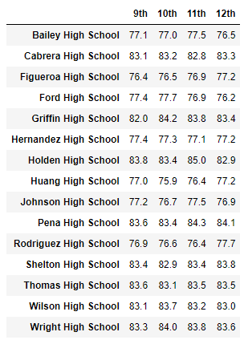
          
          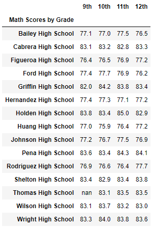
          
          - Reading Scores by Grade with and without Thomas High School's 9th Grade Population:
          
          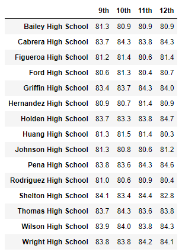
          
          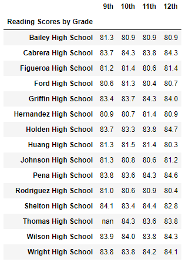
          
     - Scores by School Spending: Students attending schools that have a per pupil expenditure less than $586 continue to have high scores and higher pass rates than those schools with higher per pupil expenditures. This data was not altered by removing the Thomas High School 9th graders because THS falls into a much higher per pupil expenditure bracker ($631-$645).
          - Test Scores by Per Pupil Expenditure with Thomas High School's 9th Grade Population: 
          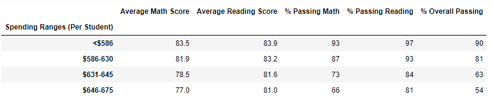
          - Test Scores by Per Pupil Expenditure without Thomas High School's 9th Grade Population: 
          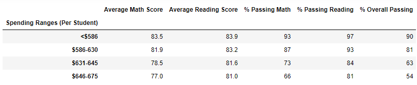
     - Scores by School Size: With rounding to the nearest tenth (score) or whole percent (percent passing), removing Thomas High School's 9th grade scores from the data did not affect score or percent passing by school size. Based on school size, scores and percent passing were significantly greater for small and medium sized schools (<2,000 students) versus large schools (2,000+ students).
     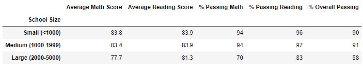
     - Scores by School Type: Similar to school size, there is no difference between our comparison on school type whether the 9th grade class at THS is included or excluded from the data. This is, again, likely due to rounding. What we can see in the data is that students at charter schools outperformed district schools is score average and pass rate by relatively significant margins. The smalles difference in pass rate was 16% and occurred in reading. 
     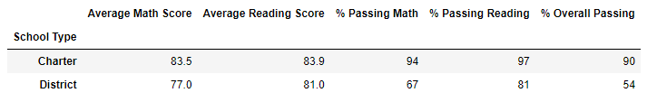

## Summary
Based on this analysis, when omitting the 9th grade data from Thomas High School, the following differences were observed: 
- 
- 
- 
- 

However, even with the omission of potentially faulty data, the scores by school spending, school size, and school type did not change. This could be due to the lack of significant figures in the data. Reformatting the data to show more decimal places may show minor differences with and without the THS 9th grade class, just as the other analysis showed. 
